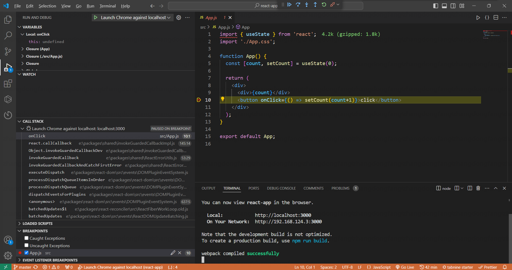

## README

React18源码调试

### 调试方法

下载[React18](https://github.com/Pcjmy/react18)项目，使用`yarn build`打包。将打包文件中`umd`目录下的`react.development.js`、`react.development.js.map`、`react-dom.development.js`、`react-dom.development.js.map`复制到本项目的public目录下，并在index.html中引入。
